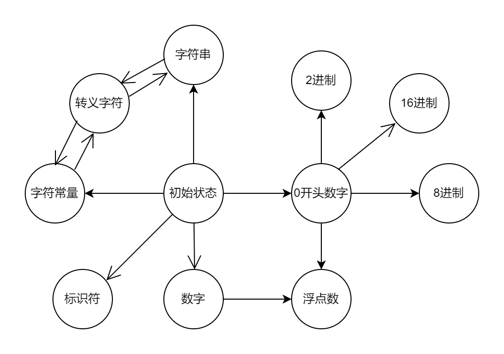
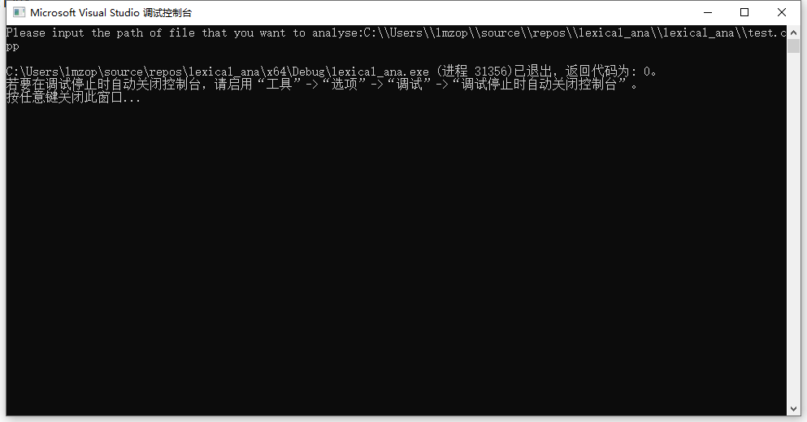

# 词法分析器

开发环境：`windows10`

IDE： `visual studio 2017`

## 程序简介

本程序参照`visual studio`的内置编译器的执行标准构建的词法分析器，可以解析c语言32个关键字，标识符的长度不设限制，常量方面，支持整形，浮点类型，字符类型，字符串类型。整数支持10进制，16进制，8进制，2进制常数，可以对过大整数（超出`uint64_t`范围）报错处理，并可以处理常量后缀。浮点数方面，也可以识别超出`double`范围浮点数，并指出错误。字符常量方面，最长长度为32位，支持转义字符。字符串方面，将一个字符串常量识别为一个单词，并将其中的转义字符处理后存储。错误处理方面，数字常数过大，字符常量过大，数字后出现的非后缀字母，数字不符合规则（出现两个`e`等）。其他错误视为语法错误。

## 符号表

| 符号类型       | 符号代号 | 符号名称           |
| -------------- | -------- | ------------------ |
| 标识符         | 0        | id                 |
| 关键字         | 1        | auto               |
| 关键字         | 2        | break              |
| 关键字         | 3        | case               |
| 关键字         | 4        | char               |
| 关键字         | 5        | const              |
| 关键字         | 6        | continue           |
| 关键字         | 7        | default            |
| 关键字         | 8        | do                 |
| 关键字         | 9        | double             |
| 关键字         | 10       | else               |
| 关键字         | 11       | enum               |
| 关键字         | 12       | extern             |
| 关键字         | 13       | float              |
| 关键字         | 14       | fot                |
| 关键字         | 15       | goto               |
| 关键字         | 16       | if                 |
| 关键字         | 17       | int                |
| 关键字         | 18       | long               |
| 关键字         | 19       | register           |
| 关键字         | 20       | return             |
| 关键字         | 21       | short              |
| 关键字         | 22       | signed             |
| 关键字         | 23       | sizeof             |
| 关键字         | 24       | static             |
| 关键字         | 25       | struct             |
| 关键字         | 26       | switch             |
| 关键字         | 27       | typedef            |
| 关键字         | 28       | union              |
| 关键字         | 29       | unsigned           |
| 关键字         | 30       | void               |
| 关键字         | 31       | volatile           |
| 关键字         | 32       | while              |
| 界符           | 33       | (                  |
| 界符           | 34       | )                  |
| 界符           | 35       | [                  |
| 界符           | 36       | ]                  |
| 界符           | 37       | {                  |
| 界符           | 38       | }                  |
| 算数运算符     | 39       | +                  |
| 算数运算符     | 40       | -                  |
| 算数运算符     | 41       | *                  |
| 算数运算符     | 42       | /                  |
| 算数运算符     | 43       | ++                 |
| 算数运算符     | 44       | --                 |
| 算数运算符     | 45       | %                  |
| 关系运算符     | 46       | ==                 |
| 关系运算符     | 47       | !=                 |
| 关系运算符     | 48       | >                  |
| 关系运算符     | 49       | <                  |
| 关系运算符     | 50       | >=                 |
| 关系运算符     | 51       | <=                 |
| 逻辑运算符     | 52       | !                  |
| 逻辑运算符     | 53       | &&                 |
| 逻辑运算符     | 54       | \|\|               |
| 赋值运算符     | 55       | =                  |
| 赋值运算符     | 56       | +=                 |
| 赋值运算符     | 57       | -=                 |
| 赋值运算符     | 58       | *=                 |
| 赋值运算符     | 59       | /=                 |
| 赋值运算符     | 60       | %=                 |
| 赋值运算符     | 61       | <<=                |
| 赋值运算符     | 62       | >>=                |
| 赋值运算符     | 63       | &=                 |
| 赋值运算符     | 64       | \|=                |
| 赋值运算符     | 65       | ^=                 |
| 位运算符       | 66       | &                  |
| 位运算符       | 67       | \|                 |
| 位运算符       | 68       | ~                  |
| 位运算符       | 69       | ^                  |
| 位运算符       | 70       | <<                 |
| 位运算符       | 71       | >>                 |
| 三目运算符     | 72       | ?                  |
| 其他运算符     | 73       | .                  |
| 其他运算符     | 74       | ->                 |
| 其他运算符     | 75       | ,                  |
| 其他运算符     | 76       | ;                  |
| 其他运算符     | 77       | :                  |
| 字符串         | 78       | string             |
| 转义字符       | 79       | escape             |
| 字符常量       | 80       | char               |
| 整形常量       | 81       | integer            |
| 双精度浮点常量 | 82       | double             |
| 非负整形常量   | 83       | unsigned integer   |
| 非负整形常量   | 84       | unsigned long      |
| 非负长整形常量 | 85       | unsigned long long |
| 整形常量       | 86       | long               |
| 长整形常量     | 87       | long long          |
| 单精度浮点常量 | 88       | float              |


## 状态转换图

程序的目标是尽可能的减少重复逻辑以加快运行速度，在初始状态完成了所有运算符和关键字的逻辑识别。一些无法确定其准确长度的单词将使用其他的状态进行处理。

## 单词处理

### 标识符处理

本分析器认为，所有以字母和下划线开始的单词，如果不是关键字，那么就是标识符。一些不可能是关键词的开头字符，例如`_`,`h`,`A`等，将直接跳转到标识符状态，在可能是标识符开头的情况下，程序会先将接受的输入与关键字比较，不是则跳转到标识符状态，在标识符状态，如果输入是字母数字和下划线，那么将会持续本状态，如果是其他任意字符都会跳出本状态，并将标识符存入缓存。

### 关键字处理

为加快运行速度，程序会根据第一个字符来选择将要进行比较的候选字符串，以此减少字符串比较次数，平均每个关键字只需要比较两次即可得出结果，缺点是需要存储更多的数据和逻辑更复杂，代码重复较多。

### 字符常量处理

在初始状态遇到`'`字符将会转到字符常量状态，程序会判断已接受的字符是否超过了4个，超过了将会输出错误信息，并将指针移到下一个`'`或者`EOF`位置。处理过程中遇到了`\`字符将会转到转义字符状态。

### 字符串处理

相比较于字符常量，字符串没有长度限制。

### 转义字符处理

对于正常转义字符，如`\n`,`\t`等，会将原字符替换转义字符，`\`后如果是`x`，转义字符是16进制数，如果是0~7数字转义字符是8进制数，如果是其他字符，程序认为转义是该字符。

### 正整数处理

程序不会识别负数，会将负数识别为两个单词，一个负号和一个正整数。遇到`.`或者`e(E)`，状态转换为浮点数，支持`u(U)`，`l(L)`,`f(F)`后缀处理。规则是，前面数字部分尽可能存贮，如果超出`uint64_t`长度，则输出报错信息。然后将以存储的数字强制转换为后缀要求类型。

### 浮点数处理

程序会判断最后的数字是否是`INF`，如果是则输出报错信息。

### 0开头数字处理

主要识别下一个字符，如果是`.`则是浮点数，转换为浮点数状态，如果是`x`则是16进制数，转为16进制状态，如果是0~7数字则是8进制数，转为8进制，如果是`b`则是2进制，转为2进制状态。其他的则是错误，输出报错信息。

## 主要数据结构

一个单词的存储形式如下

```c++
template<class T>
class token
{
public :
	code * c;
	T value;
	token(code * c, T v);
	token();
	token(code * c);
};
```

其中code是符号类型，为方便语法分析器处理，所以符号表的分类较细。

```c++
typedef struct CODE
{
	int num;
	char name[20];
}code;
```

## 使用方法

程序在运行后需要输入需要解析的文件路径，错误信息会直接输出，结果会放到与程序同级目录下的`result.txt`文件中。



运行结果放在了result1.txt文件中。

## 测试

共测试了5个文件，`test1.cpp `测试了关键字和数字解析，`test2.cpp`测试了字符常量和字符串，`test3.cpp`测试了超长注释，`test4.cpp`测试C语言常规文件，`test4.cpp`测试超长文件，来检测程序健壮性。测试结果，不计算输出结果时间，总耗时11ms。测试文件和结果见同文件夹下。

